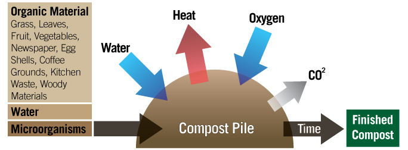
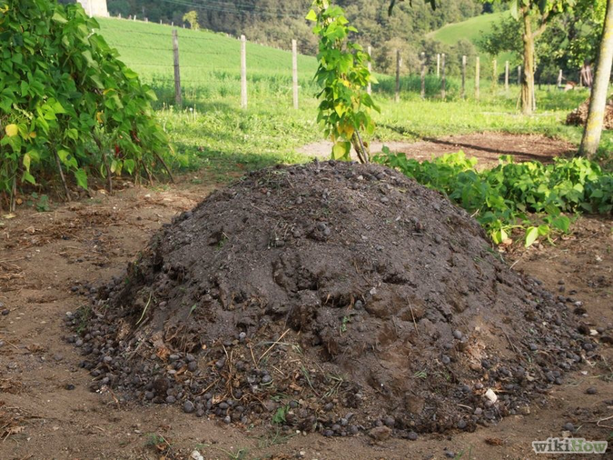
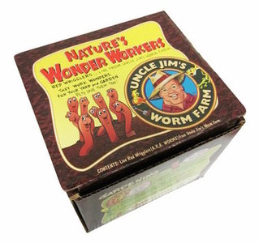
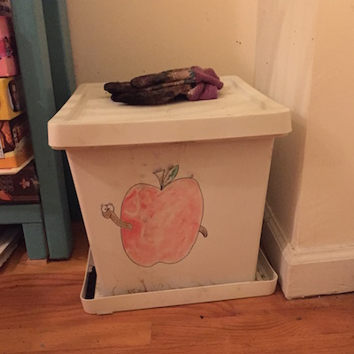
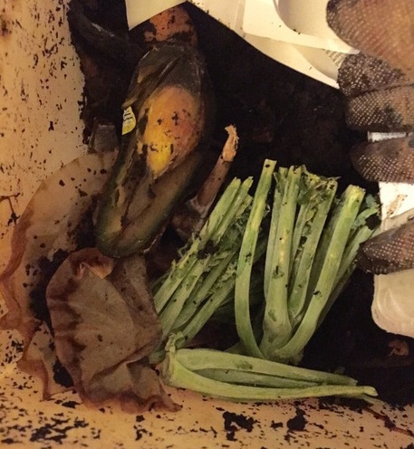
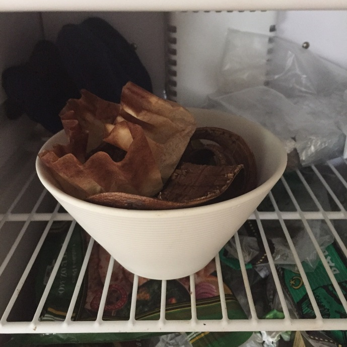
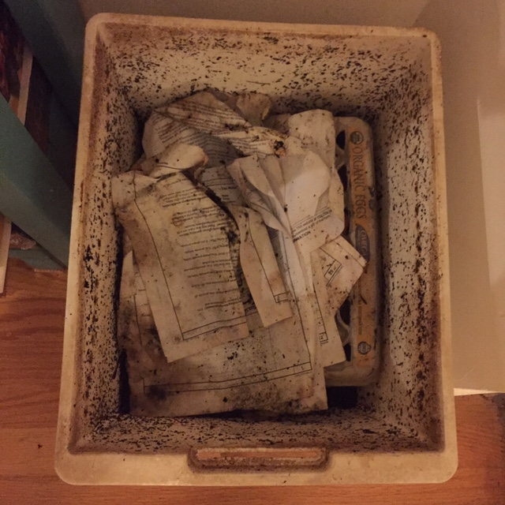
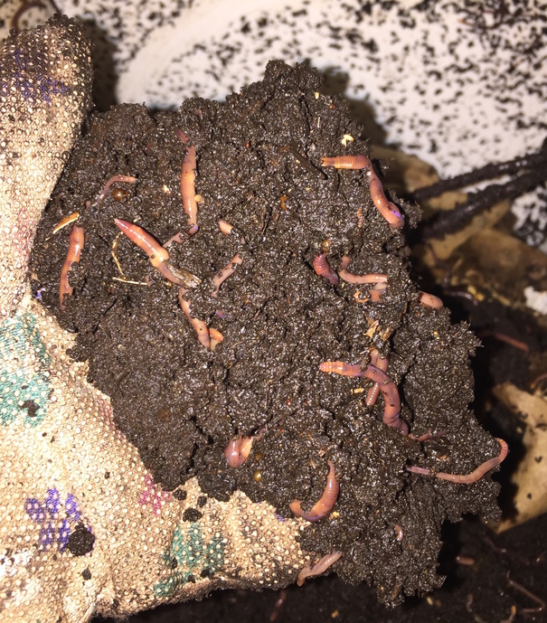

<meta name="description" content="test"/>

##Not saving the environment

Though composting is great for the environment, I mainly see this project as a fun science experiment. I also hope that maybe we'll get some good fertilizer for our plants.

Our environmental problems run deep and I worry about personal "micro-environmentalism" projects lulling us into a false sense of environmental security. We're not going to just compost and carpool our way out of our problems but that's another post.

<figure>
   
<figcaption style="color: #aaa">
  Don't worry guys. I'm composting.
</figcaption>
</figure>

##Ok but about the environment

Ok but for the sake of science, composting is pretty cool.

<figure></figure>

Here's the ;tldr on composting:

* Organic material breaking down in a landfill = methane gas

* Organic material breaking down in a compost pile = CO₂ gas

Ok wait...

<figure></figure>

Yes, we're deliberately producing CO₂ which is probably the most vilified greenhouse gas. It turns out methane is worse. Way worse. [25 times](http://epa.gov/climatechange/ghgemissions/gases/ch4.html) to be exact. Sometimes it's actually captured from landfills and burnt into CO₂ to produce energy.

Compost piles still produce a small amount of methane but much less than just dumping the garbage.

##Old-school composting

We decided it’d be fun to try composting ourselves since NYC doesn’t do it yet. Unfortunately, we didn’t have space for a huge pile of dirt in our living room like this.

<figure></figure>

Also, reading through stuff online about composting, it sounded like these piles involve a delicate [balancing act between nitrogen-rich and carbon-rich material](http://www.wikihow.com/Reduce-the-Odor-of-Composting) to keep from smelling. Honestly, I didn’t trust myself to be on the hook for much more than just throwing everything in a box and forgetting about it so this probably wasn’t a good option.

##I got worms

I started reading more and it sounded like worm composting (sometimes called “vermicomposting”) was a better option because it is compact and low maintenance.

I ended up getting a container from the Container Store, drilling some holes in it and throwing everything in. Then, I bought some worms from Amazon. I started out with [250 red wigglers](http://www.amazon.com/Uncle-Jims-Worm-Farm-Composting/dp/B00EZPSSGY). I would encourage you to go small here because they’ll multiply fast if they’re doing well.

<figure>
   
<figcaption style="color: #aaa">
  You can buy basically anything on Amazon. Anything.
</figcaption>
</figure>

This isn’t a comprehensive how-to guide since there are many people online who know what they’re doing better. I made mine piecing together guides like [this one](http://whatcom.wsu.edu/ag/compost/easywormbin.htm) and others I found googling. From a bunch of reading, it sounds like this is what really matters when constructing it:

- Container should be a opaque (the worms hate light)
- Drill a ton of holes in the top/sides for ventilation, the bottom for drainage

Here's what ours looks like:

<figure></figure>

As you can see from the photo, I didn’t even do the two-bin thing which means it’ll be more work to sort through later and harvest the finished compost. I may convert to two-bin at some point.

I also don’t have it lifted off the ground which is bad but it seems to be going fine. It used to be (using some cups) but the compost is very heavy at this point (probably over twenty pounds) and so I took them out (need to find something sturdier like bricks). Note: the drainage from this can be used as a powerful fertilizer known as "worm tea".

These folks even make a [ready-to-go solution](http://www.amazon.com/Worm-Factory-WF360B-Composter-Black/dp/B002LH47PY/ref=sr_1_1?s=lawn-garden&ie=UTF8&qid=1430589493&sr=1-1&keywords=worm+bin). Even though you can build this for ~$20, if you don’t have a drill and just want something you know that will work well, $100 isn’t insane.

##Feeding the guys

Most of what we are feeding the worms is coffee grinds and banana peels. Maybe some occasional egg shells or avocado pits too. This is likely violating the carbon/nitrogen balance rules but we'll see how the plants feel about it. The fact the the avocado pits are continuously sprouting when I bury them here makes me think that the soil is probably reasonable.

<figure></figure>

One big thing that I think has probably helped keep the bin clean and not smelling is that we freeze the food before putting it in the bin. We just keep a bowl in the freezer which has worked pretty well.

<figure></figure>

I tend to feed these guys in bulk. Not just because of the freezing but also so that I can bury the food a bit and/or cover it with paper.

<figure></figure>

##Tips

###They try to escape

They are probably just getting used to their new environment. Give them some time. I put some dirt in to start it which I think helped them settle in though it was Miracle-Gro which I later read is bad because it can burn the worms! Luckily, it didn't seem to hurt them this time.

Also make sure that you keep it aired out and not too wet.

###Other bugs

We had some other [small white worms](http://www.compostjunkie.com/white-worms.html) in our bin for a while. I was worried at first but it sounds like they aren't a big deal.

It sounds like you can also get maggots which is pretty frightening. I think the freezing that we do helps kill off any eggs they might have on banana peels and such.

###No meat, dairy

These will stink it up and cause problems like maggots.

##How it's going

It's generally going pretty well. The worms are eating a ton. They actually even pounded a pair of old, ripped cotton boxers that I threw in (after freezing of course) which I was very impressed with.

<figure>
   
<figcaption style="color: #aaa">
Happy worms live in Brooklyn.
</figcaption>
</figure>

I also gave a little of the dirt to one of my plants and it seems to be doing well so I think it's going to make decent fertilizer. At least it's not like, toxic for the plant or anything.

Sadly, we're going to have to stop this soon because we're moving cross-country again but hopefully can start up again in California!

<figure>
   
<figcaption style="color: #aaa">
Happy worming!
</figcaption>
</figure>

